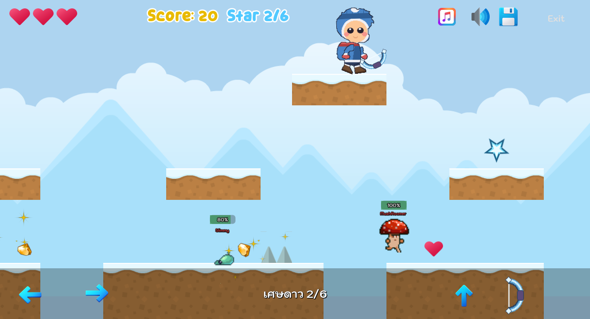
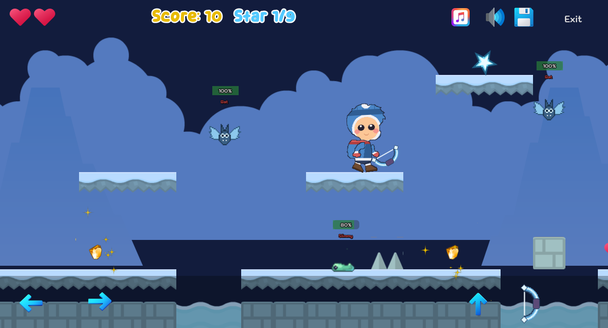

# FROZEN STAR

**แบบฝึกหัดที่ 4 — สร้างเกมแบบ 2D Platform Side-Scrolling**
วิชา Computer Game Development · ภาคการศึกษาต้น ปีการศึกษา 2569
วิทยาลัยการคอมพิวเตอร์ มหาวิทยาลัยขอนแก่น
อาจารย์ผู้สอน: ผศ.ดร.วชิราวุธ ธรรมวิเศษ

**ผู้จัดทำ:** 673380447-2 พัชราภา อินปากดี (สาขา AI)

---

## ภาพตัวอย่าง




## ลิงก์

- 🎮 **เล่นเกม (GitHub Pages):** `https://<ชื่อบัญชี-github>.github.io/<ชื่อ-repository>/`
- 🎬 **คลิปวิดีโอสาธิตการเล่น:** `<ใส่ลิงก์ YouTube หรือ Google Drive ที่นี่>`
- 💻 **GitHub Project:** [`https://github.com/<ชื่อบัญชี-github>/<ชื่อ-repository>`
](https://github.com/dearpatchaa2005-glitch/Lab4-frozen-star)
---

## Game Story — เนื้อเรื่องย่อ

เหนือดินแดนน้ำแข็งมี **ดาวดวงหนึ่ง** ที่คอยส่องแสงอุ่นให้ผู้คนมานานแสนนาน
คืนหนึ่งดาวดวงนั้นร่วงหล่นลงมาและแตกออกเป็น **เศษดาว** กระจายหายไปทั่วทุ่งหิมะและถ้ำน้ำแข็ง
ดินแดนจึงค่อย ๆ หนาวเหน็บและมืดลงเรื่อย ๆ

ผู้เล่นรับบทเป็น **นักผจญภัย** ที่อาสาออกตามหาเศษดาวทั้งหมด เพื่อนำกลับไปคืนสู่ท้องฟ้า
ระหว่างทางต้องผ่านทุ่งหิมะ ถ้ำน้ำแข็ง และธารน้ำแข็งที่อันตราย
โดยเก็บเศษดาวและหลบกับดักไปเรื่อย ๆ จนครบทั้ง 3 ด่าน

**เป้าหมายหลัก:** เก็บเศษดาวให้ครบตามจำนวนที่กำหนดในแต่ละด่าน แล้วเดินทางไปถึงประตูทางออก

---

## รูปแบบการเล่น และ กติกา

### รูปแบบการเล่น
- เดินซ้าย–ขวา และกระโดดข้ามสิ่งกีดขวาง (กระโดดได้ 2 ครั้ง)
- เก็บเศษดาวและเหรียญระหว่างทาง
- หลีกเลี่ยงกับดักและศัตรู
- กระโดดเหยียบหัวศัตรูเพื่อกำจัดศัตรูได้
- เดินทางไปยังประตูทางออกของแต่ละด่าน เมื่อผ่านด่านจะเข้าสู่ด่านถัดไป

### กติกา
- ตัวละครมีพลังชีวิต **3 หน่วย** (❤️❤️❤️)
- โดนศัตรู กับดัก หรือตกหลุม จะเสียพลังชีวิต 1 หน่วย
- พลังชีวิตหมด จะเริ่มด่านนั้นใหม่
- ต้องเก็บเศษดาวให้ครบตามจำนวนที่กำหนด **ประตูทางออกจึงจะเปิด**
- เก็บเหรียญเพื่อสะสมคะแนน

### ปุ่มควบคุม

| ปุ่ม | การทำงาน |
|---|---|
| `A` / `←` | เดินซ้าย |
| `D` / `→` | เดินขวา |
| `Space` / `W` / `↑` | กระโดด (กดซ้ำได้ 2 ครั้ง) |
| `X` | โจมตี |

รองรับการเล่นบนมือถือและเว็บด้วยปุ่มสัมผัสบนหน้าจอ

ในเกมมีหน้า **How to Play** ที่เมนูหลัก อธิบายปุ่มควบคุม กติกา และไอเท็มที่ต้องเก็บพร้อมรูปประกอบ

---

## ตัวละคร

| ตัวละคร | รายละเอียด |
|---|---|
| **นักผจญภัย** | ตัวละครหลักที่ผู้เล่นควบคุม สวมชุดกันหนาวและถือธนูน้ำแข็ง เดินและกระโดดได้ มีพลังชีวิต 3 หน่วย |
| **Slime** | ศัตรูพื้นฐาน เดินไป–กลับอยู่กับที่บนพื้น ถ้าผู้เล่นสัมผัสจะเสียพลังชีวิต |
| **Frost Bat** | ค้างคาวน้ำแข็ง บินขึ้น–ลงในบางพื้นที่ ใช้เพิ่มความท้าทายในบางจุดของด่าน |
| **Mushroom** | ศัตรูวิ่งบนพื้น เพิ่มความหลากหลายให้แต่ละด่าน |

---

## ไอเทม ปริศนา และ กับดัก

### ไอเทม
- ⭐ **Star** — เศษดาว เก็บครบตามจำนวนเพื่อเปิดประตูทางออก
- 🪙 **Coin** — เพิ่มคะแนน
- ❤️ **Heart** — เพิ่มพลังชีวิต
- 🔑 **Key** — ใช้เปิดประตูที่ล็อกอยู่ในด่าน 2

### กับดัก
- หนามน้ำแข็ง (Spike)
- **หินย้อยน้ำแข็ง (Icicle)** — ห้อยจากเพดานถ้ำ สั่นเตือนแล้วร่วงลงมา
- หลุมและแอ่งน้ำแข็ง
- แท่นที่ตกลงมา (Falling Platform)

### ปริศนา
- หา Key เพื่อเปิดประตูที่ล็อกอยู่
- เก็บเศษดาวให้ครบตามจำนวนที่กำหนดของด่านนั้น
- เลือกเส้นทางที่ถูกต้องเพื่อไปถึงประตูทางออก

---

## ด่านในเกม

| ด่าน | ชื่อด่าน | เศษดาว | รายละเอียด |
|---|---|---|---|
| 1 | **ทุ่งหิมะขาว** | 6 | จุดเริ่มต้นของการเดินทาง กลางแจ้งท่ามกลางทุ่งหิมะ ด่านนี้มีหลุมและสิ่งกีดขวางไม่มาก เน้นให้ผู้เล่นฝึกการเดินและกระโดดพื้นฐาน |
| 2 | **ถ้ำน้ำแข็ง** | 7 | ร่องรอยของเศษดาวนำผู้เล่นลงไปในถ้ำใต้ธารน้ำแข็ง เพิ่มหินย้อยน้ำแข็งที่ร่วงจากเพดานและหนามเข้ามา บางจุดถูกล็อกด้วยประตู ต้องหา Key ที่ซ่อนอยู่เพื่อเปิดทางต่อไป |
| 3 | **ใจกลางธารน้ำแข็ง** | 9 | ด่านสุดท้ายของเกม ลึกที่สุดในธารน้ำแข็ง มีศัตรูทั้ง Slime และ Frost Bat ปนกัน รวมถึงกับดักหลายแบบมากขึ้นกว่าด่านก่อนหน้า |

---

## ประโยชน์ของเกม

- ฝึกการสังเกตและการแก้ปัญหา
- ฝึกการควบคุมตัวละครและการตัดสินใจ
- สร้างความสนุกและความเพลิดเพลิน
- ฝึกการวางแผนเส้นทางเพื่อผ่านอุปสรรค
- ผู้พัฒนาได้ฝึกการสร้างเกม 2D และออกแบบระบบเกม

---

## โครงสร้างโปรเจกต์

```
Scenes/
├── Actors/
│   ├── player.gd / player.tscn      ตัวละครผู้เล่น (พลังชีวิต 3 หน่วย, เหยียบศัตรูได้)
│   ├── bat.gd / bat.tscn            ค้างคาวน้ำแข็ง บินขึ้น-ลง
│   ├── monster_slim.tscn            Slime เดินไป-กลับบนพื้น
│   └── enemy.gd                     คลาสฐานของศัตรูทั้งหมด
├── Levels/
│   ├── base_level.gd                สคริปต์กลางของทุกด่าน
│   ├── level_01/02/03.tscn          ด่านที่ 1-3
│   ├── menu.tscn / credit.tscn      เมนูหลัก และหน้าเครดิต
│   ├── howto.tscn                  หน้าอธิบายวิธีเล่นและกติกา
│   ├── game_over.tscn / game_win.tscn   ฉากจบ และ ฉากชนะ
│   └── game_ui.gd / game_ui.tscn    UI แสดงหัวใจ คะแนน เศษดาว กุญแจ
├── Prefabs/
│   ├── pickup.gd                    ไอเทมทุกชนิด (Star / Key / Heart / Coin)
│   ├── star / key_item / heart      ไอเทมในเกม
│   ├── trap_spike / icicle          กับดัก
│   ├── falling_platform             แท่นที่ตกลงมา
│   ├── moving_platform              แผ่นเลื่อน
│   ├── locked_door                  ประตูที่ต้องใช้กุญแจเปิด
│   └── level_finish_door            ประตูทางออก (เปิดเมื่อเก็บเศษดาวครบ)
└── Managers/
    ├── game_manager.gd              ระบบพลังชีวิต เศษดาว กุญแจ คะแนน Save/Load
    └── audio_manager.gd             ระบบเสียง
```

---

## การพัฒนาต่อ

โปรเจกต์นี้สร้างด้วย **Godot Engine 4.7**

1. Clone โปรเจกต์ลงเครื่อง
2. เปิด Godot แล้วเลือก **Import** ไฟล์ `project.godot`
3. กด **Run** (F5) เพื่อเล่นเกม

### การ Export เป็นเว็บ
1. เมนู `Project` → `Export...`
2. เพิ่ม preset **Web**
3. ตั้งค่า Export Path เป็น `docs/index.html`
4. กด **Export Project** แล้ว Commit ขึ้น GitHub
5. เปิด `Settings` → `Pages` → เลือก Branch `main` โฟลเดอร์ `/docs`

---

## เครดิตทรัพยากรที่ใช้

- Tileset และ Sprite พื้นฐาน: [Kenney.nl](https://kenney.nl/assets) (CC0)
- โครงสร้างเริ่มต้น: [2D-Platformer-Starter-Kit](https://github.com/computingkku/2D-Platformer-Starter-Kit) — College of Computing, Khon Kaen University
- สไปรท์เศษดาว (`star.png`), หินย้อยน้ำแข็ง (`icicle.png`) และค้างคาวน้ำแข็ง (`bat.png`): วาดขึ้นใหม่สำหรับโปรเจกต์นี้
- ตัวละครนักผจญภัยชุดกันหนาว (`student_thai.png`), ธนูน้ำแข็ง (`WandT2.png`) และลูกศรน้ำแข็ง (`bullet.png`): วาดขึ้นใหม่สำหรับโปรเจกต์นี้
